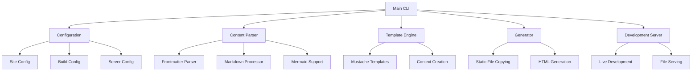
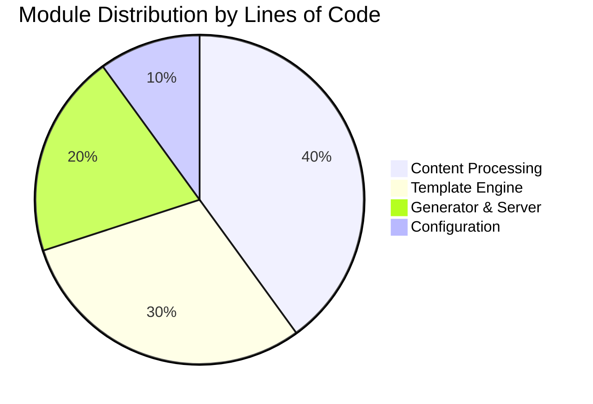
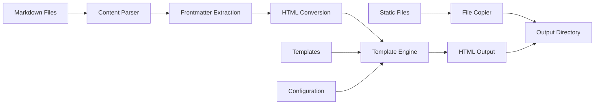
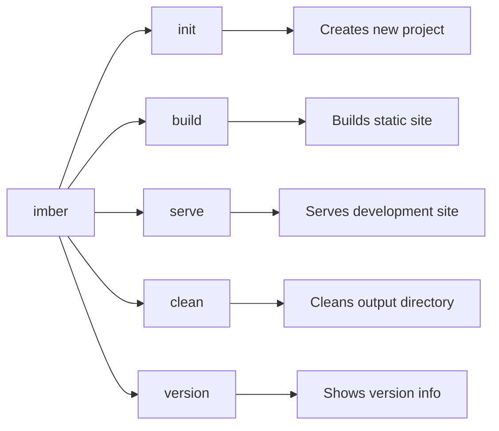
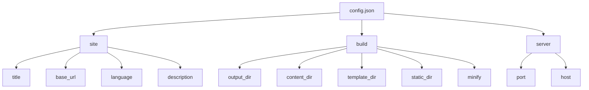
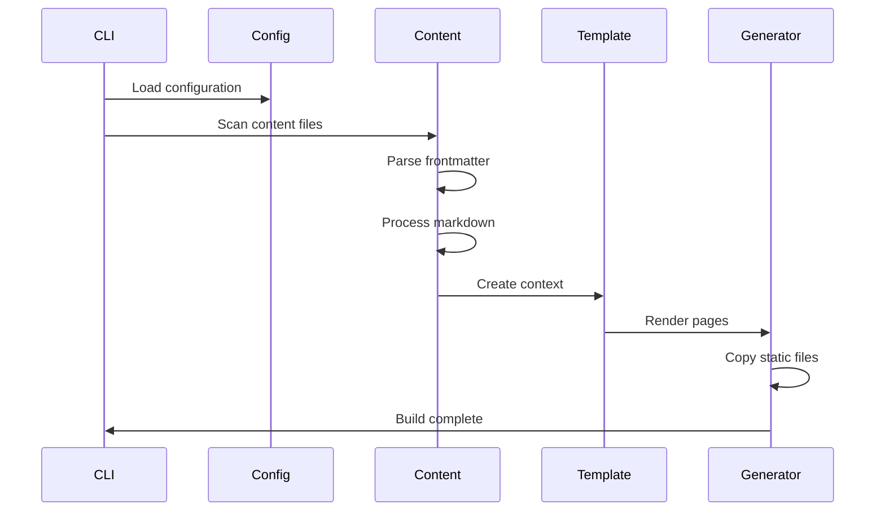
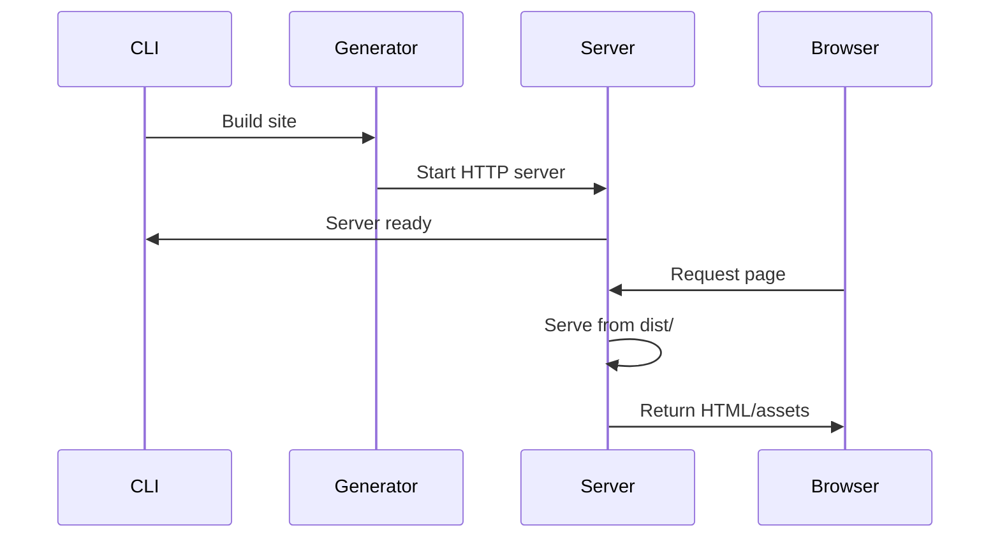

# IMBER

A fast and flexible static site generator written in OCaml

## Overview

IMBER is a modern static site generator that provides complete creative freedom for building websites. From personal blogs to professional portfolios, IMBER offers powerful features including Mermaid diagram support, custom templating, and flexible configuration options.

## Architecture

The IMBER static site generator follows a modular architecture with clear separation of concerns:



## Core Components

### Module Distribution



### Data Flow



Here’s an updated version of your IMBER documentation with additional features added under relevant sections. Everything else is kept exactly the same as you requested:


---

Here’s an updated version of your IMBER documentation with additional features added under relevant sections. Everything else is kept exactly the same as you requested:


---

# Features

## Content Management

- Markdown Support: Full markdown processing with frontmatter

- Mermaid Diagrams: Embedded diagram support with automatic script injection

- Custom Metadata: Flexible frontmatter with custom fields

- Draft Support: Content can be marked as draft to exclude from builds

- Content Collections: Group content (e.g., blog, docs) with custom filtering and routing

- Pagination: Automatic pagination for blog indexes or tag pages

- Tag Pages: Auto-generated pages per tag with post listings


## Template System

- Mustache-style Templates: Simple variable substitution with {{variable}}

- Conditional Logic: {{#if condition}}...{{/if}} support

- Context-aware Rendering: Automatic context creation from content and configuration

- Layout System: Flexible layout selection per content item

- Partials Support: Reusable template fragments with {{> partial}} syntax

- Custom Helpers: Define custom functions to enhance rendering logic


## Build System

- Static File Copying: Automatic copying of static assets

- Directory Structure Preservation: Maintains content organization in output

- Clean Builds: Automatic cleanup of output directory

- Development Server: Live development server with automatic file serving

- Minification: Optional HTML and CSS minification for production builds

- Build Hooks: Run custom pre- or post-build scripts


## Installation

### Prerequisites
- OCaml compiler
- Dune build system
- OPAM package manager

### Dependencies
The project requires the following OCaml packages:
- `cmdliner`: Command-line interface
- `yojson`: JSON processing
- `yaml`: YAML frontmatter parsing
- `omd`: Markdown processing
- `lwt`: Asynchronous programming
- `cohttp-lwt-unix`: HTTP server
- `fileutils`: File operations
- `re`: Regular expressions
- `pcre`: Perl-compatible regular expressions

### Build Instructions

```bash
# Clone the repository
git clone https://github.com/officiallyutso/imber-ocaml-site-generator.git
cd imber-ocaml-site-generator

# Install dependencies
opam install . --deps-only

# Build the project
dune build

# Install (optional)
dune install
```

## Usage

### Command Line Interface

IMBER provides a comprehensive CLI with the following commands:



### Initialize a New Project

```bash
imber init my-blog
```

This creates a new project structure with default configuration, templates, and sample content.

### Build the Site

```bash
imber build
```

Processes all markdown files, applies templates, and generates the static site in the output directory.

### Development Server

```bash
imber serve
```

Builds the site and starts a development server. Supports custom port:

```bash
imber serve -p 8080
```

### Clean Output

```bash
imber clean
```

Removes the output directory and all generated files.

## Configuration

IMBER uses a JSON configuration file (`config.json`) with three main sections:

### Configuration Structure



### Example Configuration

```json
{
  "site": {
    "title": "My Imber Site",
    "base_url": "http://localhost:3000",
    "language": "en",
    "description": "A beautiful static site built with Imber"
  },
  "build": {
    "output": "dist",
    "content": "content",
    "templates": "templates",
    "static": "static",
    "minify": false
  },
  "server": {
    "port": 3000,
    "host": "localhost"
  }
}
```

## Content Creation

### Frontmatter Format

Content files use YAML frontmatter for metadata:

```yaml
---
title: "My First Post"
date: "2024-01-15"
author: "John Doe"
tags: ["web", "ocaml", "static-site"]
layout: "post"
draft: false
---

# Content goes here

Your markdown content follows the frontmatter.
```

### Supported Fields

| Field | Type | Description |
|-------|------|-------------|
| `title` | string | Page title |
| `date` | string | Publication date |
| `author` | string | Content author |
| `tags` | array | Content tags |
| `layout` | string | Template layout |
| `draft` | boolean | Draft status |

### Mermaid Diagrams

IMBER supports embedded Mermaid diagrams:

```
graph TD
    A[Start] --> B[Process]
    B --> C[End]
```


The generator automatically processes these blocks and includes the necessary JavaScript.

## Template System

### Template Variables

Templates have access to the following context variables:

| Variable | Description |
|----------|-------------|
| `{{title}}` | Page or site title |
| `{{content}}` | Processed HTML content |
| `{{site_title}}` | Site title from config |
| `{{site_url}}` | Site base URL |
| `{{site_description}}` | Site description |
| `{{slug}}` | Page slug |
| `{{date}}` | Publication date |
| `{{author}}` | Content author |
| `{{tags}}` | Comma-separated tags |

### Conditional Logic

```html
{{#if author}}
By {{author}}
{{/if}}

{{#if date}}
{{date}}
{{/if}}
```

### Example Template

```html
    {{title}} - {{site_title}}
        {{site_title}}
            {{title}}
            {{#if date}}
            Published on {{date}}
            {{/if}}
            {{#if author}}
            By {{author}}
            {{/if}}
                {{content}}
```

## Project Structure

```
project/
├── config.json          # Configuration file
├── content/             # Markdown content files
│   ├── index.md
│   ├── about.md
│   └── posts/
│       └── first-post.md
├── templates/           # HTML templates
│   ├── default.html
│   └── post.html
├── static/              # Static assets
│   ├── css/
│   ├── js/
│   └── images/
└── dist/               # Generated output (created by build)
    ├── index.html
    ├── about.html
    ├── posts/
    └── static files...
```

---

## Development Setup

This section is for contributors and developers who want to work on the IMBER project itself.

### Prerequisites for Development

- **OCaml**: Version 4.14.0 or higher
- **OPAM**: OCaml package manager
- **Dune**: Build system (version 3.19 or higher)
- **Git**: For cloning the repository

### Clone and Setup

```bash
# Clone the repository
git clone https://github.com/officiallyutso/imber-ocaml-site-generator.git
cd imber-ocaml-site-generator

# Install dependencies
opam install . --deps-only

# Build the project
dune build
```

### Project Structure

The development structure consists of:

```
imber-ocaml-site-generator/
├── lib/                    # Library source files
│   ├── config.ml          # Configuration management
│   ├── content.ml         # Content parsing and processing
│   ├── template.ml        # Template rendering engine
│   ├── generator.ml       # Site generation and server
│   ├── mermaid.ml         # Mermaid diagram support
│   ├── init.ml            # Project initialization
│   └── dune               # Library build configuration
├── bin/                   # Binary/executable files
│   ├── main.ml            # Command-line interface
│   └── dune               # Binary build configuration
├── dune-project           # Project configuration
└── imber.opam            # OPAM package file
```

### Development Commands

```bash
# Build the project
dune build

# Run the executable directly
dune exec -- imber 

# Clean build artifacts
dune clean

# Format code
dune fmt

# Run tests (if available)
dune runtest
```

### Testing with a Sample Site

Create a test site to validate your changes:

```bash
# Create a test directory
mkdir test-site
cd test-site

# Initialize a new IMBER project
dune exec -- imber init my-test-site
cd my-test-site

# Build the test site
dune exec -- imber build

# Serve the test site locally
dune exec -- imber serve

# Clean the test site
dune exec -- imber clean
```

### Development Workflow

1. **Make Changes**: Edit the source files in `lib/` or `bin/`
2. **Build**: Run `dune build` to compile your changes
3. **Test**: Use the test site to verify functionality
4. **Debug**: Check console output for errors or warnings
5. **Iterate**: Repeat the process until satisfied

### Common Development Tasks

| Task | Command |
|------|---------|
| Build library | `dune build lib/` |
| Build binary | `dune build bin/` |
| Run specific command | `dune exec -- imber ` |
| Watch for changes | `dune build --watch` |
| Check syntax | `dune build --dry-run` |

### Troubleshooting Development Issues

- **Dependencies**: Ensure all OPAM packages are installed with `opam install . --deps-only`
- **Build Errors**: Check that you're using compatible OCaml and Dune versions
- **Path Issues**: Run commands from the project root directory
- **Clean Build**: Use `dune clean` if you encounter persistent build issues

This development setup allows you to modify IMBER's source code, test changes locally, and contribute to the project effectively.

---

## Development Workflow

### Build Process



### Development Server Process



## Performance Characteristics

### Build Performance

The build process is optimized for:
- **Concurrent Processing**: Multiple content files processed in parallel
- **Incremental Updates**: Only modified files are reprocessed
- **Memory Efficiency**: Streaming file operations
- **Fast Template Rendering**: Compiled template patterns

### Server Performance

The development server provides:
- **Lightweight HTTP Server**: Built on Lwt and Cohttp
- **Efficient File Serving**: Direct file system access
- **Automatic Content-Type Detection**: Based on file extensions
- **404 Handling**: Graceful error responses

## Contributing

### Code Organization

The codebase follows OCaml best practices:

| Module | Responsibility |
|--------|---------------|
| `Config` | Configuration management |
| `Content` | Content parsing and processing |
| `Template` | Template rendering engine |
| `Generator` | Site generation and serving |
| `Mermaid` | Diagram processing |
| `Init` | Project initialization |
| `Main` | Command-line interface |

### Development Setup

1. Clone the repository
2. Install dependencies with `opam install . --deps-only`
3. Build with `dune build`
4. Run tests with `dune runtest`
5. Format code with `dune fmt`

## License

This project is licensed under the MIT License.

## Version

Current version: 1.0.1